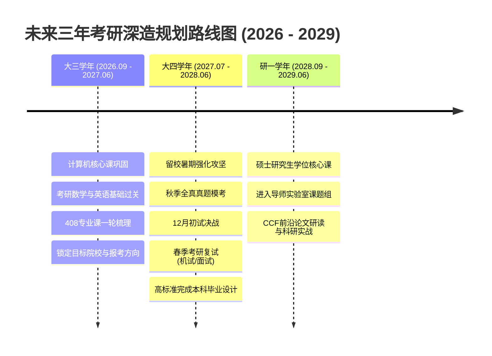

# Hi there, I'm King-Zhi 👋

  

  <!-- 打字机：加入了 center=true 和 vcenter=true 保证绝对居中 -->
  

    
  

  

    <b>福州大学 · 计算机科学与技术专业</b>
  

  

    <a href="#about-me">关于我</a> •
    <a href="#tech-stack">技术栈</a> •
    <a href="#projects">实践经历</a> •
    <a href="#self-assessment">自我评估</a> •
    <a href="#roadmap">三年规划</a>
  

---

## 🙋‍♂️ 关于我 (About Me)

- 🎓 **学历背景**：福州大学 计算机科学与技术专业 本科在读
- 💡 **技术理念**：信奉“工程不仅是编写代码，更是构建可靠、可演进的系统”，热衷于敏捷开发、自动化与全栈工程。
- 🎨 **兴趣爱好**：
  - 这是一个值得深思的问题……
- 🌟 **想与大家分享的经历**：这是我来到这个世界上的第 **7605** 天。
---

## 🛠️ 技术栈与技能树 (Tech Stack)

### 编程语言 (Languages)

### 框架与工程工具 (Frameworks & Tools)

---

## 🚀 项目与实践经历 (Projects)
用AI做的一个半成品（  ）

---

## 🧭 自我评估 (Self-Assessment)

### 1. 已掌握的专业知识与能力
- **编程基础与算法思维**：掌握 C/C++ 面向过程与面向对象思想，熟悉常用算法与数据结构，具备一定的复杂度分析与代码重构能力。
- **现代工具链使用**：熟练运用 Git 进行代码版本控制、分支管理及 GitHub 协同开发。

### 2. 感兴趣的技术方向
- **智能软件工程 (AI + SE)**：探索 LLM 与代码生成/代码审查的结合，利用现代 AI 工具（如 Codex、Claude、Antigravity）加速软件全生命周期交付。
- **现代化全栈交付**：追求高可用、高响应性、交互美观的前后端闭环产品研发。

### 3. 最希望学习与提升的知识
- **大型软件工程生命周期管理**：深入理解需求工程、系统架构设计（UML/设计模式）、敏捷开发 Scrum 流程与自动化 CI/CD 流水线。
- **团队协作与工程规范**：在团队大作业中学习代码审查（Code Review）、规范分支合并策略及协同冲突解决。
- **工程化测试体系**：从单元测试、集成测试到自动化压力测试，掌握如何编写具备高健壮性、可维护性的高质量工业级代码。

---

## 🎯 未来三年发展规划 (3-Year Roadmap)

- **第一阶段（大三学年 · 2026.09 - 2027.06 · 扎根与备考启动）**：
  - **大三上**：学好软件工程、数据库、操作系统等课程，自学前后端开发所需技能与技术栈。
  - **大三下**：全面开启考研一轮复习。数学过完基础考点，英语攻克考研核心词汇与真题长难句，启动 408（数据结构、计组、操作系统、计网）基础梳理；综合评估自身实力，锁定目标院校与报考方向。
- **第二阶段（大四学年 · 2027.07 - 2028.06 · 暑期强化与决战初复试）**：
  - **暑期与秋季**：留校全身心投入强化备考，刷透近 15 年数学与 408 统考真题，结合政治大题背诵进行全真模考冲刺；
  - **初试与复试**：12 月底全力以赴参加考研初试；初试结束后立即准备机试（刷 LeetCode / 算法题）和专业课面试，主动联系导师；
  - **毕业交付**：高标准完成本科毕业设计，顺利取得学位并收获研究生录取通知书。
- **第三阶段（研一学年 · 2028.09 - 2029.06 · 角色蜕变与学术起步）**：
  - 顺利入学，高绩点修完研究生学位核心课；进入导师实验室课题组，参与实际科研或横向课题；
  - 研读 CCF 推荐会议与期刊的前沿论文，在导师指导下确立研究生课题方向，开启学术研究与高阶工程创新的新阶段。

