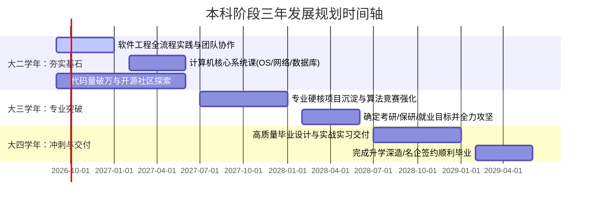

# Hi there, I'm King-Zhi 👋

  

  <!-- 打字机：加入了 center=true 和 vcenter=true 保证绝对居中 -->
  

    
  

  

    <b>福州大学 · 计算机科学与技术专业</b>
  

  

    <a href="#-关于我-about-me">关于我</a> •
    <a href="#-技术栈与技能树-tech-stack">技术栈</a> •
    <a href="#-项目与实践经历-projects">实践经历</a> •
    <a href="#-自我评估-self-assessment">自我评估</a> •
    <a href="#-未来三年规划-3-year-roadmap">三年规划</a>
  

---

## 🙋‍♂️ 关于我 (About Me)

- 🎓 **学历背景**：福州大学 计算机科学与技术专业 本科在读
- 💡 **技术理念**：信奉“工程不仅是编写代码，更是构建可靠、可演进的系统”，热衷于敏捷开发、自动化与全栈工程。
- 🎨 **兴趣爱好**：
  - 这是一个值得深思的问题……
- 🌟 **想与大家分享的经历**：这是我来到这个世界上的第 **7605** 天。
---

## 🛠️ 技术栈与技能树 (Tech Stack)

### 编程语言 (Languages)

### 框架与工程工具 (Frameworks & Tools)

---

## 🚀 项目与实践经历 (Projects)

| 项目名称 | 技术栈 | 核心职责与亮点 |
| :--- | :--- | :--- |
| **Flux Realism 交互生成系统** | Python, Flask, Hugging Face API, Tailwind CSS | 对接 Hugging Face Serverless 推理路由，实现 FLUX 写实 LoRA 模型的微调生成，设计响应式前端与实时调用日志监控控制台。 |
| **经典数据结构与算法实践库** | C / C++, Git | 实现链表、红黑树、图算法等核心数据结构，完成 LeetCode 经典题目的规范化模块化实现与单元测试。 |
| **轻量级学生信息/任务管理系统** | Python / Java, 文件IO/SQLite | 采用 MVC 模式设计，支持数据的增删改查、输入合法性校验及多条件筛选导出。 |

---

## 🧭 自我评估 (Self-Assessment)

### 1. 已掌握的专业知识与能力
- **编程基础与算法思维**：扎实掌握 C/C++ 面向过程与面向对象思想，熟悉常用算法与数据结构，具备一定的复杂度分析与代码重构能力。
- **现代工具链使用**：熟练运用 Git 进行代码版本控制、分支管理及 GitHub 协同开发；熟练使用 VS Code、PyCharm 等 IDE 进行断点调试。
- **Web 与 API 交互**：理解 HTTP 协议与 RESTful API 设计规范，能够利用 Python/Flask 独立完成前后端数据交互与接口封装。

### 2. 感兴趣的技术方向
- **智能软件工程 (AI + SE)**：探索 LLM 与代码生成/代码审查的结合，利用现代 AI 原生工具（如 Cursor、DeepSeek、Hugging Face）加速软件全生命周期交付。
- **云原生与后端架构**：对高并发分布式架构、微服务拆分、容器化（Docker/K8s）及中间件设计有极高热情。
- **现代化全栈交付**：追求高可用、高响应性、交互美观的前后端闭环产品研发。

### 3. 最希望学习与提升的知识
- **大型软件工程生命周期管理**：深入理解需求工程、系统架构设计（UML/设计模式）、敏捷开发 Scrum 流程与自动化 CI/CD 流水线。
- **团队协作与工程规范**：在团队大作业中学习代码审查（Code Review）、规范分支合并策略及协同冲突解决。
- **工程化测试体系**：从单元测试、集成测试到自动化压力测试，掌握如何编写具备高健壮性、可维护性的高质量工业级代码。

---

## 🎯 未来三年发展规划 (3-Year Roadmap)

> **核心发展导向**：【请选择并保留你的核心方向：保研深造 / 考研攻坚 / 知名互联网企业就业 / 公共服务与选调】

- **第一阶段（大二学年 · 2026.09 - 2027.06）**：
  - 深度投入《软件工程》课程，在团队作业中承担核心开发角色，掌握 GitFlow 工作流与敏捷协作；
  - 扎实学好计算机组成原理、操作系统、计算机网络、数据库等硬核理论课；
  - 持续刷题提升算法能力，力争代码量突破 15,000 行。
- **第二阶段（大三学年 · 2027.09 - 2028.06）**：
  - 聚焦目标领域进行深度沉淀，参与实验室科研或开发高含金量开源项目，参与 CCF/蓝桥杯等专业竞赛；
  - 明确个人发展路线，系统推进复习攻坚，做好知识体系化输出。
- **第三阶段（大四学年 · 2028.09 - 2029.06）**：
  - 高标准完成本科毕业设计，将软件工程理论完全运用到工程实现中；
  - 顺利完成升学或拿到理想 Offer，完成从学生到专业软件工程师/研究者的角色蜕变。

---

## 📈 GitHub 统计看板 (GitHub Stats)

  
  

  

---

  <i>"Talk is cheap. Show me the code." —— Linus Torvalds</i>

